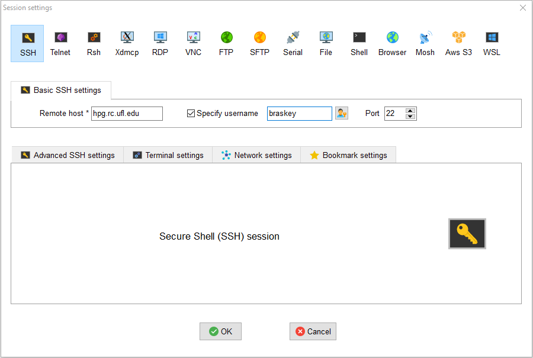
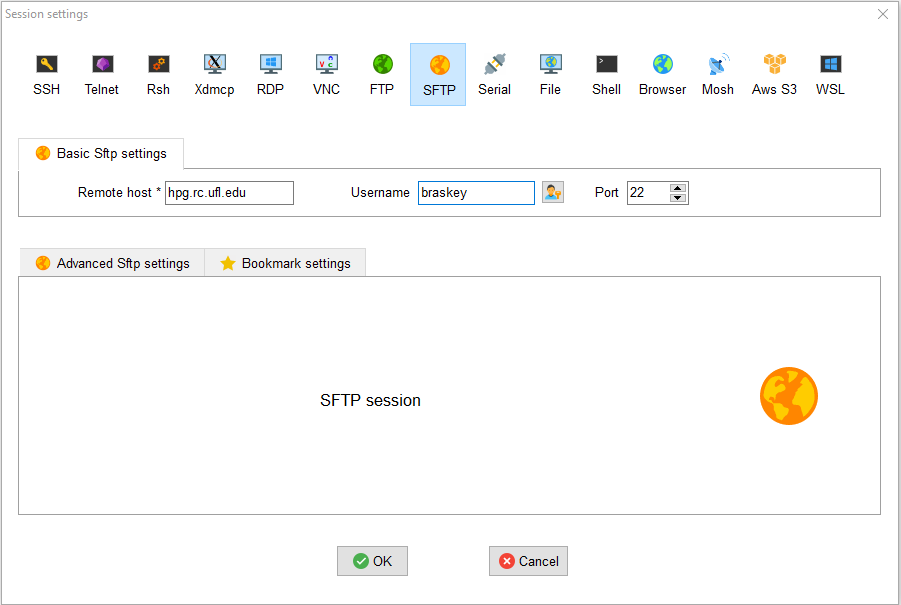
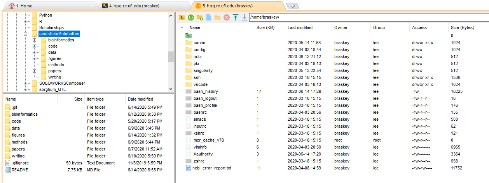

# hy5-RNAseq
This repository contains scripts used in the processing of an *Arabidopsis thaliana* RNAseq data from PRJNA549285. The goal of this project is to identify differentially expressed genes between the Col-0 and *hy5* genotypes in 2 different environmental conditions.

## Datasets:
#### PRJNA549285 RNAseq data
Burko, Y., Seluzicki, A., Zander, M., Pedmale, U.V., Ecker, J.R., and Chory, J. (2020). Chimeric Activators and Repressors Define HY5 Activity and Reveal a Light-Regulated Feedback Mechanism. *Plant Cell*. 32, 967-983.

#### TAIR10 reference genome and annotations
Lamesch, P., Berardini, T.Z, Li, D., Swarbreck, D., Wilks, C., Sasidharan, R., Muller, R., Dreher, K., Alexander, D.L., Garcia-Hernandez, M., Karthikeyan, A.S., Lee, C.H., Nelson, W.D., Ploetz, L., Singh, S., Wensel, A., and Huala, E. (2011). The Arabidopsis Information Resource (TAIR): improved gene annotation and new tools. *Nucleic Acids Research*  40(Database issue), D1202–D1210.

## Software tools:
#### SRA Toolkit 2.10.4
Leinonen, R., Sugawara, H., Shumway, M., & International Nucleotide Sequence Database Collaboration (2011). The sequence read archive. *Nucleic Acids Research*. 39(Database issue), D19–D21.

#### AdapterRemoval 2.2.2
Schubert, M., Lindgreen, S., and Orlando, L. (2016). AdapterRemoval v2: rapid adapter trimming, identification, and read merging. *BMC Research Notes*. 12, 9(1).

#### HISAT2 2.2.0
Kim, D., Paggi, J.M., Park, C., Bennett, C., and Salzberg, S.L. (2019). Graph-based genome alignment and genotyping with HISAT2 and HISAT-genotype. *Nat Biotechnol*. 37, 907–915.

#### Subread 2.0.0
Liao, Y., Smyth, G.K., and Shi, W. (2014). featureCounts: an efficient general-purpose program for assigning sequence reads to genomic features. *Bioinformatics*. 30(7), 923-930.

#### Samtools 1.10
Li, H., Handsaker, B., Wysoker, A., Fennell, T., Ruan, J., Homer, N., Marth, G., Abecasis, G., and Durbin, R. (2009). The Sequence Alignment/Map format and SAMtools. *Bioinformatics*. 25(16), 2078-2079.

# Bioinformatics analysis
The documentation in this section details the bioinformatics approaches and methods applied in this project. Ideally, the documentation here should allow someone with little to no bioinformatics experience to understand and recreate the analysis method that was used. 

Topics covered:
1. [Setting up a hipergator account](#setting-up-hipergator) \
   1.1 [SSH setup](#SSH-setup) \
   1.2 [SFTP setup](#SFTP-setup) 
2. [Submitting jobs in hipergator](#submitting-jobs) \
   2.1 [SLURM scripts](#slurm-scripts) \
   2.2 [Bash basics](#bash-basics) \
   2.3 [Output files](#output-files)
3. [Downloading datasets](#downloading-datasets) \
   3.1 [Loading the SRA tookit](#loading-sra-toolkit) \
   3.2 [Configuring the SRA toolkit](#configuring-sra-toolkit)

<a name="setting-up-hipergator"></a>
## 1. Setting up a hipergator account
The ufrc wiki provides a [pretty good guide](https://help.rc.ufl.edu/doc/Getting_Started) on how to set up a hipergator account. The first step is to request an account from your supervisor. Assuming that your supervisor has already set up a group with allocated resources in hipergator, just submit a [request account form](https://www.rc.ufl.edu/access/request-account/). Once your supervisor approves the account request, you should receive an email from ufrc stating that your account has been created. 

<a name="SSH-setup"></a>
### 1.1 SSH setup
Once your account has been created, the next step is to connect to hipergator using a Secure Shell, or SSH. An SSH is what you will use to communicate with hipergator (e.g. submit jobs, check the status of jobs). This process will differ depending on whether your computer is running Windows, Linux, or MacOS. 

**Windows users -** Since Windows doesn't come with an SSH preinstalled, you will need to download one. [MobaXTerm](https://mobaxterm.mobatek.net/) has a pretty friendly user interface, so I recommend it for newer users. [This video](https://mediasite.video.ufl.edu/Mediasite/Play/2bf4c860f19b48a593fb581018b813a11d) from ufrc provides a good tutorial for first time setup of MobaXTerm. In short, after opening MobaXTerm and clicking the "New session" button, select the "SSH" option at the top of the popup window. Then enter the name of the remote host (hpg.rc.ufl.edu), check the "Specify username" box, enter your gatorlink username, and click the "OK" button.



*An image of what MobaXTerm SSH setup would look like for my account (with gatorlink username braskey).*

If this is the first time you have connected to hipergator on the computer, you may need to click "OK" on a prompt that says something like "Host not recognized". You should then be asked for your gatorlink password. Type in your password and press enter. *Note that the cursor won't move as you type in your password - this is just a security feature meant to hide the length of your password.* MobaXTerm then may ask if your want to save your password, which you can choose to do if you're the only one using the computer. 

You should now be connected to hipergator! You will see a terminal with several messages from ufrc about policy, and a line at the end that looks similar to the one below.

```
[braskey@login4 ~]$
```

This is where you will type in commands to submit jobs, check the status of jobs, and various other things.

**Linux and MacOS users -** Both Linux and MacOS systems come with an SSH by default, which can be accessed from the terminal. [This video](https://mediasite.video.ufl.edu/Mediasite/Play/0b238bfffb684fd6b7306129af63a6711d) from ufrc provides a good tutorial for connecting to hipergator from a Mac. In Linux, begin a standard terminal session. In MacOS, launch the "Terminal" application, which by default is located in the Applications/Utilities folder. 

In both Linux and Mac environments, connect to hipergator by entering the following command in the terminal:

```
ssh braskey@hpg.rc.ufl.edu
```

Make sure to replace "braskey" with your gatorlink username first! You should then be asked for your gatorlink password. Type in your password and press enter. *Note that the cursor won't move as you type in your password - this is just a security feature meant to hide the length of your password.*

You should now be connected to hipergator! You will see a terminal with several messages from ufrc about policy, and a line at the end that looks similar to the one below.

```
[braskey@login4 ~]$
```

This is where you will type in commands to submit jobs, check the status of jobs, and various other things.

**Windows, Linux, and MacOS users -** After connecting to hipergator, it can be useful to check that your account was registered properly with the "id" command.

```
[braskey@login4 ~]$ id
uid=5284(braskey) gid=3676(lee) groups=3676(lee)
```

This should display your gatorlink id, and the id of the group that you registered with when you first requested your account.

<a name="SFTP-setup"></a>
### 1.2 SFTP setup
SFTP stands for Secure File Transfer Protocol. An SFTP is needed to to transfer files between your personal computer and the supercomputers at hipergator. Although file transfers with an SFTP can be completed through the SSH client alone, a separate SFTP client is useful because it provides an intuitive interface that Windows and MacOS users will find familiar. 

**Windows users -** If you are using MobaXTerm as your SSH client, you can use the SFTP client that is included. To start an SFTP session, click the "New session" button on the MobaXTerm home screen, and select the "SFTP" option at the top of the popup window. Similar to the SSH setup process, enter the name of the remote host (hpg.rc.ufl.edu), your gatorlink username, and click the "OK" button.



*An image of what MobaXTerm SFTP setup would look like for my account (with gatorlink username braskey).*

If this is the first time you have connected to hipergator on the computer, you may need to click "OK" on a prompt that says something like "Host not recognized". Once you've successfully connected to hipergator with the SFTP, you should see something similar to the image below.



*An image of what the MobaXTerm client should look like after setting up an SFTP.*

**Linux and MacOS users -** The SFTP client recommended by ufrc is [FileZilla](https://filezilla-project.org/). Make sure you download the client version, and not the server version. [This video](https://mediasite.video.ufl.edu/Mediasite/Play/873a2b08bf1d4ccda49a51f5c84692491d) from ufrc provides a good tutorial on how to setup FileZilla on a MacOS system. The process should be nearly identical on a Linux system. In short, after downloading and opening FileZilla, enter the name of the host (hpg.rc.ufl.edu), your gatorlink username and password, and the port (22) in the corresponding boxes at the top of the window. Click the "Quickconnect" button. If this is the first time you have connected to hipergator on the computer, you should get a popup asking if you trust the host. Click "OK" on the popup. You should now be successfully connected to hipergator.

**Windows, Linux, and MacOS users -** Both MobaXTerm and FileZilla SFTP clients have a similar layout and functionality. The left side of the window displays the filesystem of the computer you're currently using, and the right side of the window displays the filesystem of hipergator. Additionally, the text at the bottom displays recent commands and actions (e.g. file transfers, directory changes).

You can upload files to hipergator by selecting and dragging them from your computer's filesystem to hipergator's. Similarly, you can download files from hipergator by selecting and dragging them from hipergator's filesystem to your own computer's.

**IMPORTANT -** MobaXTerm/FileZilla will by default connect to your home directory in hipergator. For my account, this is ```/home/braskey/```. This home directory has limited space, and is slow to read/write to. **All code and data files should instead be saved under your ufrc directory.** If your hipergator account has been successfully created, this directory will be ```/ufrc/group-name/gatorlink-username/```. For example, my ufrc directory in the lee group is ```/ufrc/lee/braskey/```. You can change directories in MobaXTerm/FileZilla by typing your desired directory in the address bar above where the filesystem is displayed, and pressing enter.

<a name="submitting-jobs"></a>
## 2. Submitting jobs in hipergator

<a name="slurm-scripts"></a>
### 2.1 SLURM scipts

<a name="bash-basics"></a>
### 2.2 Bash basics

<a name="output-files"></a>
### 2.3 Output files

<a name="downloading-datasets"></a>
## 3. Downloading datasets
Most datasets available in the NCBI Sequencing Read Archive (SRA) can be downloaded directly into hipergator. This is much faster than downloading the dataset onto your own computer, and then uploading it from your own computer to hipergator. Downloading data directly into hipergator is done with the **SRA toolkit**.

<a name="loading-sra-tookit"></a>
### 3.1 Loading the SRA toolkit
To load the SRA toolkit, first check which version are available on hipergator with the ```module spider``` command. On the SSH command line, type the command ```module spider sra```, and press enter. You should see an output similar to that shown below.

```
[braskey@login3 ~]$ module spider sra

---------------------------------------------------------------------------------------------------
  sra:
---------------------------------------------------------------------------------------------------
    Description:
      short read archive toolkit

     Versions:
        sra/2.10.3
        sra/2.10.4
     Other possible modules matches:
        transrate  yasra

---------------------------------------------------------------------------------------------------
  To find other possible module matches execute:

      $ module -r spider '.*sra.*'

---------------------------------------------------------------------------------------------------
  For detailed information about a specific "sra" package (including how to load the modules) use the
  module's full name.
  Note that names that have a trailing (E) are extensions provided by other modules.
  For example:

     $ module spider sra/2.10.4
---------------------------------------------------------------------------------------------------


[braskey@login3 ~]$
```

The ```module spider``` command returns information about all modules with names matching that of the input. From the output of this command, I can see that the most recent version of the SRA toolkit is 2.10.4 (at the time of writing this). The output of this command also tells me that I can view more detailed information about a specific version of the toolkit with the command ```module spider sra/2.10.4```. The output of this command is shown below.

```
[braskey@login3 ~]$ module spider sra/2.10.4

---------------------------------------------------------------------------------------------------
  sra: sra/2.10.4
---------------------------------------------------------------------------------------------------
    Description:
      short read archive toolkit


    This module can be loaded directly: module load sra/2.10.4

    Help:
          SRA is the NCBI Short Read Archive toolkit. The toolkit generates loading
          and dumping tools with their respective libraries for building new and
          accessing existing runs.

          The online documentation is located at https://github.com/ncbi/sra-tools/wiki

          This module sets the following environment variables:
              * HPC_SRA_DIR - location of the installation directory
              * HPC_SRA_BIN - location of the executables directory
              * HPC_SRA_DOC - location of the documentation directory

          Reference: https://help.rc.ufl.edu/doc/SRA

      Version 2.10.4


[braskey@login3 ~]$
```

From this output, I see that I can load the SRA toolkit with the command ```module load sra/2.10.4```. Entering this command doesn't generate any visible output, but it loads the SRA toolkit module into my current session, and makes it available for me to use.

<a name="configuring-sra-tookit"></a>
### 3.2 Configuring the SRA toolkit
If this is the first time you are using the SRA toolkit from your hipergator account, it must first be configured. 