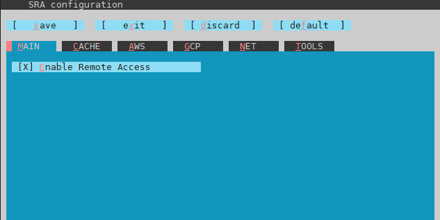
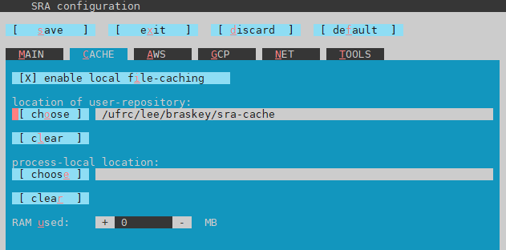

# hy5-RNAseq
This repository contains scripts used in the processing of an *Arabidopsis thaliana* RNAseq data from PRJNA549285. The goal of this project is to identify differentially expressed genes between the Col-0 and *hy5* genotypes in 2 different environmental conditions.

## Datasets:
#### PRJNA549285 RNAseq data
Burko, Y., Seluzicki, A., Zander, M., Pedmale, U.V., Ecker, J.R., and Chory, J. (2020). Chimeric Activators and Repressors Define HY5 Activity and Reveal a Light-Regulated Feedback Mechanism. *Plant Cell*. 32, 967-983.

#### TAIR10 reference genome and annotations
Lamesch, P., Berardini, T.Z, Li, D., Swarbreck, D., Wilks, C., Sasidharan, R., Muller, R., Dreher, K., Alexander, D.L., Garcia-Hernandez, M., Karthikeyan, A.S., Lee, C.H., Nelson, W.D., Ploetz, L., Singh, S., Wensel, A., and Huala, E. (2011). The Arabidopsis Information Resource (TAIR): improved gene annotation and new tools. *Nucleic Acids Research*  40(Database issue), D1202–D1210.

## Software tools:
#### SRA Toolkit 2.10.4
Leinonen, R., Sugawara, H., Shumway, M., & International Nucleotide Sequence Database Collaboration (2011). The sequence read archive. *Nucleic Acids Research*. 39(Database issue), D19–D21.

#### AdapterRemoval 2.2.2
Schubert, M., Lindgreen, S., and Orlando, L. (2016). AdapterRemoval v2: rapid adapter trimming, identification, and read merging. *BMC Research Notes*. 12, 9(1).

#### HISAT2 2.2.0
Kim, D., Paggi, J.M., Park, C., Bennett, C., and Salzberg, S.L. (2019). Graph-based genome alignment and genotyping with HISAT2 and HISAT-genotype. *Nat Biotechnol*. 37, 907–915.

#### Subread 2.0.0
Liao, Y., Smyth, G.K., and Shi, W. (2014). featureCounts: an efficient general-purpose program for assigning sequence reads to genomic features. *Bioinformatics*. 30(7), 923-930.

#### Samtools 1.10
Li, H., Handsaker, B., Wysoker, A., Fennell, T., Ruan, J., Homer, N., Marth, G., Abecasis, G., and Durbin, R. (2009). The Sequence Alignment/Map format and SAMtools. *Bioinformatics*. 25(16), 2078-2079.

# Setting up a RNAseq analysis pipeline in hipergator
The documentation in this section details the bioinformatics approaches and methods applied in this project. Ideally, the documentation here should allow someone with little to no bioinformatics experience to understand and recreate the analysis method that was used. 

#### Topics covered:
1. [Setting up a hipergator account](#setting-up-hipergator) \
   1.1 [SSH setup](#SSH-setup) \
   1.2 [SFTP setup](#SFTP-setup) 
2. [Basic bash commands](#basic-bash-commands) \
   2.1 [General commands](#general-commands) \
   2.2 [Hipergator-specific commands](#hipergator-specific-commands) 
3. [Using hipergator](#using-hipergator) \
   3.1 [Loading modules](#loading-modules) \
   3.2 [Configuring modules](#configuring-modules) \
   3.3 [Anatomy of a SLURM script](#slurm-script) \
   3.4 [Running a slurm script](#running-slurm-script) \
   3.5 [Checking outputs](#checking-outputs)
4. [A model RNAseq analysis pipeline for single-end reads](#model-pipeline) \
   4.1 [Copy data and SLURM scripts from shared folder](#copy-data) \
   4.2 [Download RNAseq data with the ```download-data.sh``` SLURM script](#download-data) \
   4.3 [Trim and filter reads with the ```trim-reads.sh``` SLURM script](#trim-reads) \
   4.4 [Align reads to the TAIR10 reference genome with the ```align-reads.sh``` SLURM script](#align-reads) \
   4.5 [Generate gene expression counts with the ```count-expression.sh``` SLURM script](#generate-counts) \
   4.6 [Perform a differential expression analysis with the ```DEG-analysis.R``` script](#deg-analysis)

<a name="setting-up-hipergator"></a>
## 1. Setting up a hipergator account
The ufrc wiki provides a [pretty good guide](https://help.rc.ufl.edu/doc/Getting_Started) on how to set up a hipergator account. The first step is to request an account from your supervisor. Assuming that your supervisor has already set up a group with allocated resources in hipergator, just submit a [request account form](https://www.rc.ufl.edu/access/request-account/). Once your supervisor approves the account request, you should receive an email from ufrc stating that your account has been created. 

<a name="SSH-setup"></a>
### 1.1 SSH setup
Once your account has been created, the next step is to connect to hipergator using a Secure Shell, or SSH. An SSH is what you will use to communicate with hipergator (e.g. submit jobs, check the status of jobs). This process will differ depending on whether your computer is running Windows, Linux, or MacOS. 

**Windows users -** Since Windows doesn't come with an SSH preinstalled, you will need to download one. [MobaXTerm](https://mobaxterm.mobatek.net/) has a pretty friendly user interface, so I recommend it for newer users. [This video](https://mediasite.video.ufl.edu/Mediasite/Play/2bf4c860f19b48a593fb581018b813a11d) from ufrc provides a good tutorial for first time setup of MobaXTerm. In short, after opening MobaXTerm and clicking the "New session" button, select the "SSH" option at the top of the popup window. Then enter the name of the remote host (hpg.rc.ufl.edu), check the "Specify username" box, enter your gatorlink username, and click the "OK" button.


*An image of what MobaXTerm SSH setup would look like for my account (with gatorlink username braskey).*

If this is the first time you have connected to hipergator on the computer, you may need to click "OK" on a prompt that says something like "Host not recognized". You should then be asked for your gatorlink password. Type in your password and press enter. *Note that the cursor won't move as you type in your password - this is just a security feature meant to hide the length of your password.* MobaXTerm then may ask if your want to save your password, which you can choose to do if you're the only one using the computer. 

You should now be connected to hipergator! You will see a terminal with several messages from ufrc about policy, and a line at the end that looks similar to the one below.

```
[braskey@login4 ~]$
```

This is where you will type in commands to submit jobs, check the status of jobs, and various other things.

**Linux and MacOS users -** Both Linux and MacOS systems come with an SSH by default, which can be accessed from the terminal. [This video](https://mediasite.video.ufl.edu/Mediasite/Play/0b238bfffb684fd6b7306129af63a6711d) from ufrc provides a good tutorial for connecting to hipergator from a Mac. In Linux, begin a standard terminal session. In MacOS, launch the "Terminal" application, which by default is located in the Applications/Utilities folder. 

In both Linux and Mac environments, connect to hipergator by entering the following command in the terminal:

```
ssh braskey@hpg.rc.ufl.edu
```

Make sure to replace "braskey" with your gatorlink username first! You should then be asked for your gatorlink password. Type in your password and press enter. *Note that the cursor won't move as you type in your password - this is just a security feature meant to hide the length of your password.*

You should now be connected to hipergator! You will see a terminal with several messages from ufrc about policy, and a line at the end that looks similar to the one below.

```
[braskey@login4 ~]$
```

This is where you will type in commands to submit jobs, check the status of jobs, and various other things.

**Windows, Linux, and MacOS users -** After connecting to hipergator, it can be useful to check that your account was registered properly with the "id" command.

```
[braskey@login4 ~]$ id
uid=5284(braskey) gid=3676(lee) groups=3676(lee)
```

This should display your gatorlink id, and the id of the group that you registered with when you first requested your account.

<a name="SFTP-setup"></a>
### 1.2 SFTP setup
SFTP stands for Secure File Transfer Protocol. An SFTP is needed to to transfer files between your personal computer and the supercomputers at hipergator. Although file transfers with an SFTP can be completed through the SSH client alone, a separate SFTP client is useful because it provides an intuitive interface that Windows and MacOS users will find familiar. 

**Windows users -** If you are using MobaXTerm as your SSH client, you can use the SFTP client that is included. To start an SFTP session, click the "New session" button on the MobaXTerm home screen, and select the "SFTP" option at the top of the popup window. Similar to the SSH setup process, enter the name of the remote host (hpg.rc.ufl.edu), your gatorlink username, and click the "OK" button.


*An image of what MobaXTerm SFTP setup would look like for my account (with gatorlink username braskey).*

If this is the first time you have connected to hipergator on the computer, you may need to click "OK" on a prompt that says something like "Host not recognized". Once you've successfully connected to hipergator with the SFTP, you should see something similar to the image below.


*An image of what the MobaXTerm client should look like after setting up an SFTP.*

**Linux and MacOS users -** The SFTP client recommended by ufrc is [FileZilla](https://filezilla-project.org/). Make sure you download the client version, and not the server version. [This video](https://mediasite.video.ufl.edu/Mediasite/Play/873a2b08bf1d4ccda49a51f5c84692491d) from ufrc provides a good tutorial on how to setup FileZilla on a MacOS system. The process should be nearly identical on a Linux system. In short, after downloading and opening FileZilla, enter the name of the host (hpg.rc.ufl.edu), your gatorlink username and password, and the port (22) in the corresponding boxes at the top of the window. Click the "Quickconnect" button. If this is the first time you have connected to hipergator on the computer, you should get a popup asking if you trust the host. Click "OK" on the popup. You should now be successfully connected to hipergator.

**Windows, Linux, and MacOS users -** Both MobaXTerm and FileZilla SFTP clients have a similar layout and functionality. The left side of the window displays the filesystem of the computer you're currently using, and the right side of the window displays the filesystem of hipergator. Additionally, the text at the bottom displays recent commands and actions (e.g. file transfers, directory changes).

You can upload files to hipergator by selecting and dragging them from your computer's filesystem to hipergator's. Similarly, you can download files from hipergator by selecting and dragging them from hipergator's filesystem to your own computer's.

**IMPORTANT -** MobaXTerm/FileZilla will by default connect to your home directory in hipergator. For my account, this is ```/home/braskey/```. This home directory has limited space, and is slow to read/write to. **All code and data files should instead be saved under your ufrc directory.** If your hipergator account has been successfully created, this directory will be ```/ufrc/group-name/gatorlink-username/```. For example, my ufrc directory in the lee group is ```/ufrc/lee/braskey/```. You can change directories in MobaXTerm/FileZilla by typing your desired directory in the address bar above where the filesystem is displayed, and pressing enter.

<a name="basic-bash-commands"></a>
## 2. Basic bash commands
Below is a list of some of the bash commands that I use most often. These commands are used by entering them on the SSH command line, or by including them in a SLURM script. The use of each of these commands will be demonstrated later, so don't worry about trying to memorize each of them. 

<a name="general-commands"></a>
### 2.1 General commands
```pwd``` - prints the current working directory. 

```cd /a/directory/``` - changes the current working directory to that specified. Absolute paths begin with a "/", but relative paths do not. Also, ".." is the command to move up 1 directory level.

```ls``` - lists all files and folders contained by the current working directory.

```cp file.txt a/copy/of/file.txt``` - copies a file (or folder) from one directory to another. *Can be any file format, not just .txt*

```mv file.txt new/location/of/file.txt``` - moves a file (or folder) from one directory to another. *Can be any file format, not just .txt*

```head -n 50 file.txt``` - prints the first 50 (or any number following -n) lines of a file. Very useful for checking very large files. *Can be any file format, not just .txt*

```tail``` - prints the last 50 (or any number following -n) lines of a file. Very useful for checking very large files. *Can be any file format, not just .txt*

<a name="hipergator-specific-commands"></a>
### 2.2 Hipergator-specific commands
```module spider module-name``` - returns information about all modules with names which partially match "module-name".

```module load module-name/module-version``` - loads a module into the environment.

```sbatch a-slurm-file.sh``` - submits a SLURM script to hipergator.

```squeue -u gatorlink-username``` - prints a list of all jobs currently running which were submitted by the specified user.

```scancel job-id``` - cancels a submitted job. The job-id of a job can be found with the ```squeue``` command.

<a name="using-hipergator"></a>
## 3. Using hipergator

<a name="loading-modules"></a>
### 3.1 Loading modules
In hipergator, a module is a set of software tools which can be used to complete specific tasks (e.g. downloading datasets, mapping/alignment). Hipergator has a large number of modules already installed, which can be [viewed here](https://help.rc.ufl.edu/doc/Applications). Any of these modules can be simply loaded into your current session with the commands ```module spider``` and ```module load```. The use of these commands is demonstrated with the SRA toolkit module.

Most datasets available in the NCBI Sequencing Read Archive (SRA) can be downloaded directly into hipergator. This is much faster than downloading the dataset onto your own computer, and then uploading it from your own computer to hipergator. Downloading data directly into hipergator is done with the **SRA toolkit**.

To load the SRA toolkit, first check which version are available on hipergator with the ```module spider``` command. On the SSH command line, type the command ```module spider sra```, and press enter. You should see an output similar to that shown below.

```
[braskey@login3 ~]$ module spider sra

---------------------------------------------------------------------------------------------------
  sra:
---------------------------------------------------------------------------------------------------
    Description:
      short read archive toolkit

     Versions:
        sra/2.10.3
        sra/2.10.4
     Other possible modules matches:
        transrate  yasra

---------------------------------------------------------------------------------------------------
  To find other possible module matches execute:

      $ module -r spider '.*sra.*'

---------------------------------------------------------------------------------------------------
  For detailed information about a specific "sra" package (including how to load the modules) use the
  module's full name.
  Note that names that have a trailing (E) are extensions provided by other modules.
  For example:

     $ module spider sra/2.10.4
---------------------------------------------------------------------------------------------------


[braskey@login3 ~]$
```

The ```module spider``` command returns information about all modules with names matching that of the input. From the output of this command, I can see that the most recent version of the SRA toolkit is 2.10.4 (at the time of writing this). The output of this command also tells me that I can view more detailed information about a specific version of the toolkit with the command ```module spider sra/2.10.4```. The output of this command is shown below.

```
[braskey@login3 ~]$ module spider sra/2.10.4

---------------------------------------------------------------------------------------------------
  sra: sra/2.10.4
---------------------------------------------------------------------------------------------------
    Description:
      short read archive toolkit


    This module can be loaded directly: module load sra/2.10.4

    Help:
          SRA is the NCBI Short Read Archive toolkit. The toolkit generates loading
          and dumping tools with their respective libraries for building new and
          accessing existing runs.

          The online documentation is located at https://github.com/ncbi/sra-tools/wiki

          This module sets the following environment variables:
              * HPC_SRA_DIR - location of the installation directory
              * HPC_SRA_BIN - location of the executables directory
              * HPC_SRA_DOC - location of the documentation directory

          Reference: https://help.rc.ufl.edu/doc/SRA

      Version 2.10.4


[braskey@login3 ~]$
```

From this output, I see that I can load the SRA toolkit with the command ```module load sra/2.10.4```. Entering this command doesn't generate any visible output, but it loads the SRA toolkit module into my current session, and makes it available for me to use.

<a name="configuring-modules"></a>
### 3.2 Configuring modules
Some modules in hipergator require configuration before they can be used. This configuration only needs to be completed the first time that you use the module from your hipergator account. Of the modules used in this workflow, the SRA toolkit is the only one which requires configuration prior to use. 

#### Configuration of the SRA tookit:

First, using the SFTP client, create an empty folder in your ufrc directory called "sra-cache". For example, for my account with the lee group, the path to this folder is ```/ufrc/lee/braskey/sra-cache```.

In the SSH client, after loading the SRA toolkit module into your current session, enter the command ```vdb-config -i``` on the command line. This will launch the SRA configuation tool. In the tool, scroll through options with the "tab" key, and select with the "enter" key. 

Here are the settings that need to be changed in the configuation tool:
1) On the "Main" tab, check the "Enable Remote Access" box.



*SRA configuation tool with "Enable Remote Access" setting checked.*

2) On the "Cache" tab, check the "enable local file-caching" box, and set "location of user-repository" to the "sra-cache" folder you created in your ufrc directory.



*SRA configuation tool with "enable local file-caching" setting checked, and "location of user-repository" set to an empty folder in my ufrc directory.*

Save the configuration, and exit the configuration tool. The SRA toolkit should now be ready for use!

<a name="slurm-script"></a>
### 3.3 Anatomy of a SLURM script
Although some commands can be entered directly on the SSH command line, it's best to use a SLURM script to complete more complex tasks. An explanation of the various parts of a SLURM script is provided below, continuing with the example of the SRA toolkit.

To use the SRA toolkit to download RNAseq datasets, we will create a SLURM scripts to call the necessary commands. A SLURM script is essentially just a code file which contains some additional information needed by hipergator. SLURM scripts are written in the **bash** language, and end with ".sh".

An example of a SLURM script that uses the SRA toolkit module to download RNAseq data is shown below:

```
#!/bin/bash
#SBATCH --job-name=download-data        # Job name
#SBATCH --mail-type=END,FAIL            # Mail events (NONE, BEGIN, END, FAIL, ALL)
#SBATCH --mail-user=braskey@ufl.edu     # Where to send mail	
#SBATCH --account=jkim6                 # Group providing CPU and memory resources
#SBATCH --qos=jkim6                     # QOS to run job on (investment or burst)
#SBATCH --ntasks=1                      # Number of CPU cores to use
#SBATCH --mem=1gb                       # Job memory request
#SBATCH --time=24:00:00                 # Time limit hrs:min:sec (max is 744:00:00)
#SBATCH --output=download-data_%j.log   # Standard output and error log

pwd; hostname; date

module load sra/2.10.4

echo 'Downloading RNA seq data from PRJNA549285'

dest=/ufrc/jkim6/share/braskey/data/PRJNA549285/

# Col-0, dark 3 days + light 1.5 hrs
fastq-dump SRR9313223 -O ${dest} 
```

```#SBATCH``` lines are used by hipergator to determine how exactly to run your job. Most importantly, they describe how many resources to allocate to the job. These lines also contain information about the name of the job, the email address to send messages to regarding the job's status, and the name of the log file which will be generated. 

```pwd; hostname; date``` prints the current working directory, name of the host, and date to the log file generated by the script. This information is useful for bookkeeping purposes.

```module load sra/2.10.4``` loads version 2.10.4 of the SRA toolkit into the environment.

```echo 'Downloading RNA seq data from PRJNA549285'``` prints "Downloading RNA seq data from PRJNA549285"  to the log file generated by the script.

```dest=/ufrc/jkim6/share/braskey/data/PRJNA549285``` creates a variable called "dest", and assigns it the value of the specified directory.

```# Col-0, dark 3 days + light 1.5 hrs``` is a comment. In bash, comments begin with a "#", and are not read by hipergator while running. They are useful for describing what commands do. In this case, I use a comment to describe the sample which I'm downloading data for.

```fastq-dump SRR9313223 -O ${dest}``` is a function from the SRA toolkit which downloads RNAseq data for the specific SRR number. In this case, I want to download data for SRR9313223. The function also allows me to specify the directory in which to download the data with the ```-O``` option. I select the directory which I specified previously in the ```dest``` variable. I tell hipergator to interpret ```dest``` as a variable by adding a ```$``` in front, and wrapping it in ```{}```.

<a name="running-slurm-script"></a>
### 3.4 Running a SLURM script
To run a SLURM script as a job, the script first needs to be uploaded into your ufrc directory in hipergator. This is most easily done with an SFTP. 

After the script has been uploaded, it must be submitted to hipergator using an SSH. First, navigate to the directory which contains the SLURM script in the SSH using the ```cd``` command, followed by the path to the directory containing the SLURM script. Check that you are in the correct directory by printing a list of all files in the directory with the ```ls``` command. Submit the job with the ```sbatch``` command, followed by the name of the name of SLURM script. You can check the status of the job with the ```squeue -u``` command, followed by your gatorlink username.

For example, to submit a SLURM script named ```download-data.sh``` that I uploaded to ```/ufrc/jkim6/share/braskey/slurm-scripts/```, I would enter the commands below:

```
[braskey@login4 ~]$ cd /ufrc/jkim6/share/braskey/slurm-scripts/
[braskey@login4 slurm-scripts]$ ls
download-data.sh                        
[braskey@login4 slurm-scripts]$ sbatch download-data.sh
Submitted batch job 55014474
[braskey@login4 slurm-scripts]$ squeue -u braskey
             JOBID PARTITION     NAME     USER ST       TIME  NODES NODELIST(REASON)
          55014474 hpg2-comp download  braskey  R       0:05      1 c29a-s1
[braskey@login4 slurm-scripts]$
```

<a name="checking-outputs"></a>
### 3.5 Checking outputs
In addition to any output files generated by the commands in a SLURM script, each submitted SLURM script will also generate a .log file. These .log files are named according to the ```#SBATCH --output``` command in the SLURM script. By checking a .log file, you can get information about the current status of a running job.

Most importantly, the .log file contains information about any errors encountered during the run. This can be used to fix bugs, and to confirm the validity of results. Some functions will still generate outputs if they encounter an error while running, so it's important to check the .log file to make sure all commands were executed successfully.

<a name="model-pipeline"></a>
## 4. A model RNAseq analysis pipeline for single-end reads
This RNAseq analysis pipeline analyzed a subset of samples from the PRJNA549285 bioproject. These samples are listed below.

|#|SRA number|Genotype|Treatment|
|---|---|---|---|
|1|SRR9313209|Col-0|Dark 3 days|
|2|SRR9313210|Col-0|Dark 3 days|
|3|SRR9313211|Col-0|Dark 3 days|
|4|SRR9313212|*hy5*|Dark 3 days|
|5|SRR9313213|*hy5*|Dark 3 days|
|6|SRR9313214|*hy5*|Dark 3 days|
|7|SRR9313223|Col-0|Dark 3 days, light 1.5 hrs|
|8|SRR9313224|Col-0|Dark 3 days, light 1.5 hrs|
|9|SRR9313225|Col-0|Dark 3 days, light 1.5 hrs|
|10|SRR9313226|*hy5*|Dark 3 days, light 1.5 hrs|
|11|SRR9313227|*hy5*|Dark 3 days, light 1.5 hrs|
|12|SRR9313228|*hy5*|Dark 3 days, light 1.5 hrs|

**A basic RNAseq analysis pipeline has 5 steps:**
1) Downloading/uploading data into hipergator. This data includes: \
   a) Raw Illumina reads (.fastq or .fq) \
   b) A reference genome (.fasta or .fa) and annotations (.gff or .gtf)
2) Removing adapters and trimming low quality bases from reads
3) Alignment of prepared reads to reference genome
4) Counting of reads which aligned to genomic features (i.e. genes)
5) Differential expression analysis

In this workflow, these steps are broken up into several SLURM files. Following is a description of the procedure that can be used to recreate this analysis pipeline on your own hipergator account.

<a name="copy-data"></a>
### 4.1 Copy data and SLURM scripts from shared folder
There are several SLURM scripts and data files in the directory ```/ufrc/jkim6/share/labmtg_20200709/```. You can view them with your SFTP client. From the SSH command line, copy the ```labmtg_20200709/``` directory and its contents into your own ufrc personal folder with the ``cp`` command. Use the ```-r``` flag so that all files contained by the directory are copied!

Your command should look similar to (but not the same as) below:
```
[braskey@login4 ~]$ cp -r /ufrc/jkim6/share/labmtg_20200709 /ufrc/jkim6/share/braskey/labmtg_20200709
```

<a name="download-data"></a>
### 4.2 Download RNAseq data with the ```download-data.sh``` SLURM script
In the ```labmtg_20200709/slurm-scripts``` folder that you copied, there is a file named ```download-data.sh```. Navigate to this file using the SFTP. To modify this file, you can either: download it onto your own computer, edit it there, and reupload it to hipergator **OR** edit it using your SFTP's built-in text editor. *(For smaller edits like the ones needed here, I find it's easier to use the latter method.)*

There are 3 places in the script marked with "..." where edits need to be made:

On line 4, edit ```#SBATCH --mail-user=...@ufl.edu``` to specify your ufl email.

On line 18, edit ```reads=/ufrc/jkim6/...``` to specify the directory into which RNAseq .fastq files will be downloaded.

On line 21, edit ```for id in ...``` to specify the SRA numbers of the samples you want to download data for. For example, if I wanted to download data for SRR9313209, SRR9313210, and SRR9313211, I would modify this line to:

```
for id in SRR9313209 SRR9313210 SRR9313211
```

The script is now ready for submission! To submit the script as a job, navigate to its location with your SSH, and submit it with the ```sbatch``` command.

After the job has finished, check that there weren't any errors by looking at the log file with your SFTP. The log file will be generated in the same directory as the script. You should use your SFTP to check that the data files are present in the directory that you specified.

*Note: I have been having some problems with ```fastq-dump``` randomly crashing with an Error code 3. To download data for any samples which cause this error, I've found that I can run ```fastq-dump``` directly on the SSH command line without any problems.*

<a name="trim-reads"></a>
### 4.3 Trim and filter reads with the ```trim-reads.sh``` SLURM script
The ```trim-reads.sh``` script uses the AdapterRemoval module to trim adapter sequences from reads, and filter out low quality reads. This step is necessary because adapter sequences and low quality reads can interefere with alignment of reads.

Similar to the ```download-data.sh``` script, there are several lines in the ```trim-reads.sh``` script which need to be edited.

On line 4, edit ```#SBATCH --mail-user=...@ufl.edu``` to specify your ufl email.

On line 18, edit ```reads=/ufrc/jkim6/...``` to specify the directory into which RNAseq .fastq files were previously downloaded. This will also be the directory in which new trimmed .fastq files are saved.

On line 20, edit ```for id in ...``` to specify the SRA numbers of the samples which you downloaded data for in the previous step.

The script is now ready for submission! To submit the script as a job, navigate to its location with your SSH, and submit it with the ```sbatch``` command.

After the job has finished, check that there weren't any errors by looking at the log file with your SFTP. You should also check that the trimmed .fastq files are present in the directory that you specified.

<a name="align-reads"></a>
### 4.4 Align reads to the TAIR10 reference genome with the ```align-reads.sh``` SLURM script
The ```align-reads.sh``` script uses the HISAT2 module to align the trimmed and filtered reads to the reference genome. Aligning reads back to a reference genome allows us to determine the locations in the genome which the reads came from. Prior to alignment, an index must be generated from the reference genome. This index is a set of files which contain the same information as the reference .fasta file, but formatted and sorted in a way that allows for more time-efficient alignment.

Same as previously, there are several lines in the ```align-reads.sh``` script which need to be edited.

On line 4, edit ```#SBATCH --mail-user=...@ufl.edu``` to specify your ufl email.

On line 18, edit ```index=/ufrc/jkim6/...``` to specify the directory which contains the reference TAIR10.fasta file. The index will generated in the same directory.

On line 19, edit ```reads=/ufrc/jkim6/...``` to specify the directory which contains the trimmed and filtered reads generated in the previous step.

On line 20, edit ```aln=/ufrc/jkim6/...``` to specify the directory in which output alignment files will be saved.

On line 26, edit ```for id in ...``` to specify the SRA numbers of the samples which you trimmed and filtered the reads of in the previous step.

The script is now ready for submission! To submit the script as a job, navigate to its location with your SSH, and submit it with the ```sbatch``` command.

After the job has finished, check that there weren't any errors by looking at the log file with your SFTP. You should also check that the .sam alignment files are present in the directory that you specified.

<a name="generate-counts"></a>
### 4.5 Generate gene expression counts with the ```count-expression.sh``` SLURM script
The ```count-expression.sh``` script takes the reads that were mapped to the reference genome, and counts the number of reads that were mapped to each genomic feature (i.e. gene). This requires a .gff or .gtf annotation file, which specifies the locations of genes in the reference genome.

Same as previously, there are several lines in the ```count-expression.sh``` script which need to be edited.

On line 4, edit ```#SBATCH --mail-user=...@ufl.edu``` to specify your ufl email.

On line 18, edit ```aln=/ufrc/jkim6/...``` to specify the directory in which .sam alignment files are saved.

On line 19, edit ```index=/ufrc/jkim6/...``` to specify the directory which contains the TAIR10.gff annotation file. Unless it has been moved, it will be in the same directory as the HISAT2 index.

On line 20, edit ```counts=/ufrc/jkim6/...``` to specify the directory in which the expression count files will be saved.

On line 24, edit ```for id in ...``` to specify the SRA numbers of the samples which you have generated .sam alignment files for in the previous step.

The script is now ready for submission! To submit the script as a job, navigate to its location with your SSH, and submit it with the ```sbatch``` command.

After the job has finished, check that there weren't any errors by looking at the log file with your SFTP. You should also check that the expression count files are present in the directory that you specified. There should also be a file in this directory called "gene-lengths.txt" which contains gene length data, as well as a subfolder in called "just-counts" which contains only the expression count data of each gene.

<a name="deg-analysis"></a>
### 4.6 Perform a differential expression analysis with the ```DEG-analysis.R``` script
The ```DEG-analysis.R``` script uses the edgeR package to generate normalized expression counts (e.g. RPKM, FPKM). The normalized counts from different sample groups can be compared to each other, allowing for the identification of differentially expressed genes.

Because the gene expression count files are quite small, they can be downloaded from hipergator onto your own computer. In addition, a basic differential expression analysis is not very computationally intensive, so the ```DEG-analysis.R``` script doesn't need to be run on hipergator.

Using your SFTP, download the gene expression count files that are saved in the "just-counts" subfolder of the "counts" directory you specified previously. For ease of downstream processing, these files should be saved in a folder by themselves. Also download the "gene-lengths.txt" file from the "counts" directory. And finally, download the ```DEG-analysis.R``` script, which is in the "R-scripts" subdirectory of "labmtg_20200709".

Open the ```DEG-analysis.R``` script in RStudio, and make the following edits.

On line 12, edit ```justCounts <- "..."``` to specify the directory which contains the gene expression count files.

On line 13, edit ```geneLengths <- "..."``` to specify the full path to the "gene-lengths.txt" file.

On line 18, edit ```group=c(...))``` to specify which experimental group each sample belongs to. Group identity should be indicated with a single integer. As R will read the gene expression count files in ascending numerical order, group identities should be listed to match this order. For example, say I'm processing the following files: SRR9313209-counts.txt, SRR9313210-counts.txt, SRR9313223-counts.txt, and SRR9313224-counts.txt. To reflect the experimental groups that these samples belong to, I would assign groups with the following command:
```
group=c(1,1,2,2))
```

The script is now ready to run! The script generates 2 outputs which should have special attention paid to them. 

The first output is the "rpkm" datatable, which contains data about the Reads Per Kilobase of transcript, per Million mapped reads (RPKM). RPKM is a measure of gene expression that is normalized for both the total number of transcripts in a sample (i.e. library size), and the length of each gene measured.

The second output is a Multidimensional Scaling (MDS) plot. This plot provides information about the "relatedness" of each sample. In other words, it measures how similar the overall expression patterns of different samples are to one another. If your RNAseq analysis has been completed successfully, you should see groups forming between samples from the same experimental group.
